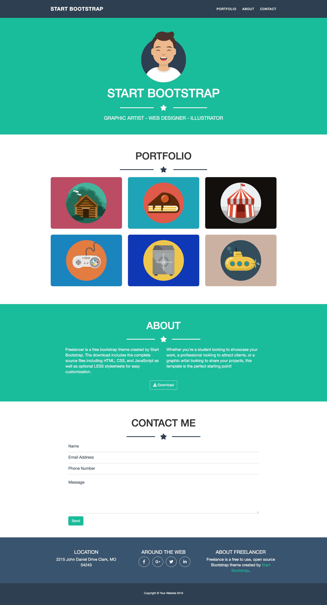

# Frontend Mentor - Start Bootstrap

This is a solution to the Boolean Academy Exercize (27/02/2023)

## Table of contents

- [Overview](#overview)
  - [The challenge](#the-challenge)
  - [Screenshot](#screenshot)
  - [Links](#links)
- [My process](#my-process)
  - [Built with](#built-with)
- [Author](#author)

## Overview

### The challenge

Users should be able to:

- View the optimal layout depending on their device's screen size
- See hover states for interactive elements

### Screenshot
## Desktop

## Tablet

## Mobile

### Links

- Solution URL: [https://github.com/filecc/html-css-bootstrap-freelancer](https://github.com/filecc/html-css-bootstrap-freelancer)
- Live Site URL: [https://filecc.github.io/html-css-bootstrap-freelancer/](https://filecc.github.io/html-css-bootstrap-freelancer/)

## My process

### Built with

- Semantic HTML5 markup
- CSS custom properties
- Mobile-first workflow
- [Bootstrap](https://https://getbootstrap.com/) - CSS library

## Author

- Website - [Instagram](https://www.instagram.com/filecc)
- Frontend Mentor - [@filecc](https://www.frontendmentor.io/profile/filecc)
- Twitter - [@_filecc](https://www.twitter.com/_filecc)

